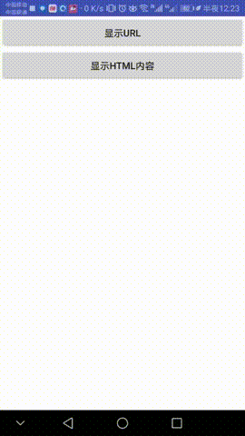
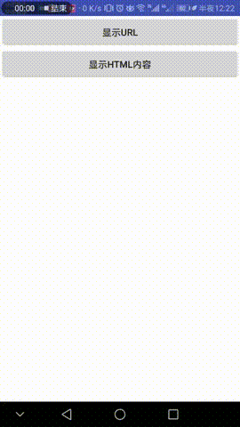
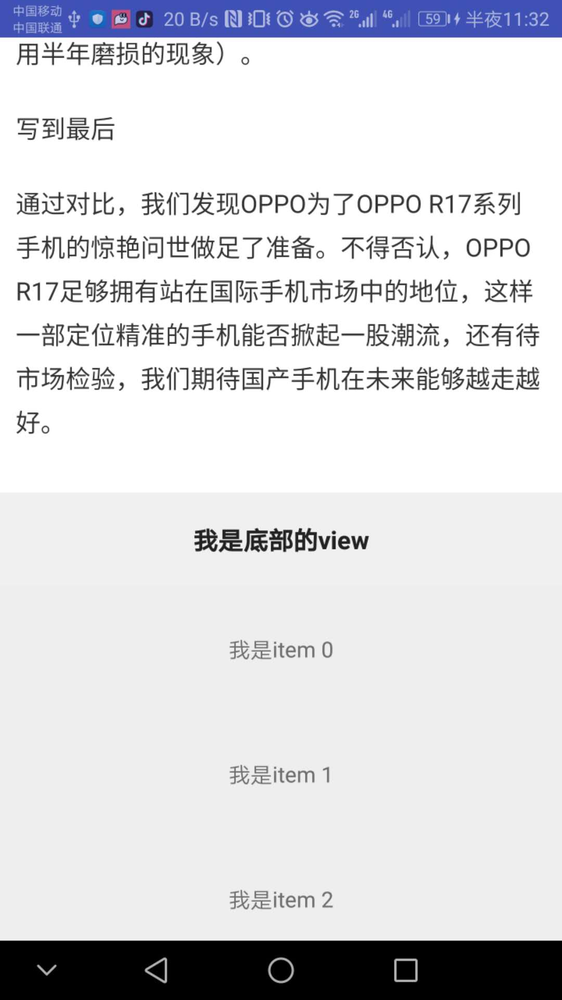

### 仿今日头条/网易新闻文章详情页面

使用WebView+RecyclerView组合,嵌套滚动。滚动机制基于HeaderViewPager，在dispatchTouchEvent中进行事件处理。
除了RecyclerView还支持ListView等。

- 支持url或者html标签填充
- 填充的html图片支持点击回调
- 支持修改加载失败的默认图

文档待续完成中。。。

待完成功能:
- 1,video标签全屏适配
- 2,滑动webView过程中图片懒加载
- 3,移动网络不加载图片，点击加载图片
- 4,定位阅读位置

参考资料:
- CoolIndicator
- https://github.com/Justson/CoolIndicator
- HeaderViewPager
- https://github.com/jeasonlzy/HeaderViewPager
- richeditor-android
- https://github.com/wasabeef/richeditor-android

